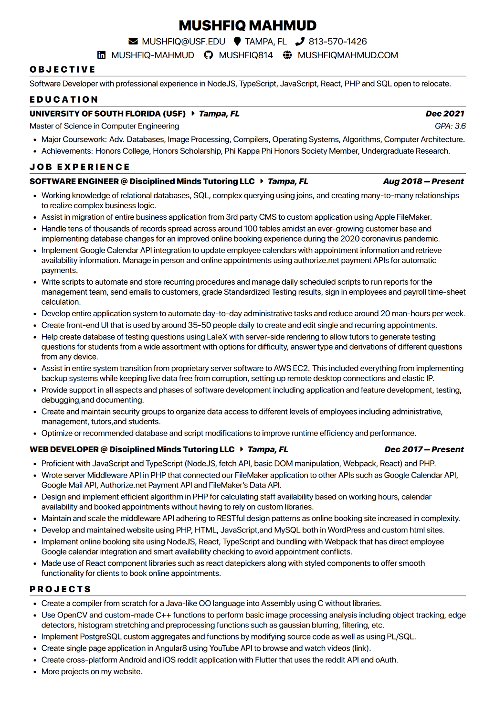

# Resume

Contains tools to generate a resume in pdf using [React PDF renderer](https://github.com/diegomura/react-pdf/tree/master/packages/renderer).

## Toolchain

This project uses the following tools:

* NodeJS: JavaScript engine
* TypeScript: provides type checking at compile time
* React: declarative UI to make resume
* ReactPDF: generate PDF files from React virtual tree
* eslint: linting and enforcing consistent code style

## Contributing

Have any criticisms about my resume? Please [submit an issue](https://github.com/mushfiq814/resume/issues/new/choose) and tell me about it. I would greatly appreciate it!

## Compiling

Make sure `nodejs` and `npm` (or `yarn`) are installed. Instructions for [node](https://nodejs.org/en) and [yarn](https://classic.yarnpkg.com/en/)

```sh
$ npm run compile
# or
$ yarn compile
```

## Linting

```sh
# to check lint warnings/errors
$ npm run lint
# or
$ yarn lint

# to fix lint warnings/errors
$ npm run lint:fix
# or
$ yarn lint:fix
```

## Preview


